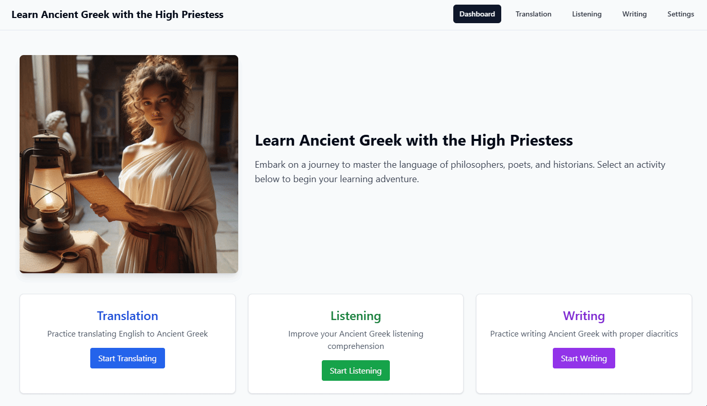

# free-genai-bootcamp-2025

## Project Overview

For a more detailed presentation, please see the SR&ED [Final Project Presentation](final_project_presentation.md)


> Journals
- [Preweek Journal](journal/week0.md)
- [Week 1 Journal](journal/week1.md)
- [Week 2 Journal](journal/week2.md)
- [Week 3 Journal](journal/week3.md)
- [Week 4 Journal](journal/week4.md)

## Table of Contents
- [Table of Contents](#table-of-contents)
- [Ancient Greek Translation API with Mistral 7B Instruct v0.3 on Lightning.ai](#ancient-greek-translation-api-with-mistral-7b-instruct-v03-on-lightningai)
- [Deploy language portal on your local machine](#deploy-language-portal-on-your-local-machine)
- [Ancient Greek Listening app with coqui-ai model on docker](#ancient-greek-listening-app-with-coqui-ai-model-on-docker)
- [Writing Practice of Diacritics](#writing-practice-of-diacritics)

# **Build the app**

## Ancient Greek Translation API with Mistral 7B Instruct v0.3 on Lightning.ai

This guide provides step-by-step instructions to reproduce and deploy the Mistral 7B Instruct v0.3 translation model using Lightning.ai and FastAPI. The model translates English sentences into Ancient Greek.


### Prerequisites

- Python 3.10
- [Lightning.ai](https://lightning.ai/) account
- Hugging Face account and [API token](https://huggingface.co/settings/tokens)

### 1. Clone the Repository into a Lightning studio with GPU

```bash
git clone <repository-url>
cd mistral_translation_app
```

### 2. Install Dependencies

```bash
pip install -r requirements.txt
```

### 3. Set Hugging Face Token

Set your Hugging Face token as an environment variable:

```bash
export HF_TOKEN='your_huggingface_token_here'
```

### 4. Set API key


```bash
export SECRET_API_KEY='a_secret_key'
```

### 4. Run Locally (Testing)

To run your API locally and test:

```bash
python app.py
```
This might take a few minutes.

### In another terminal

Test translation example:

```bash
⚡ ~ curl -X POST "http://localhost:8080/translate?sentence=Wildboars%20are%20at%20the%20door,%20did%20you%20leave%20the%20garbage%20out?" -H "api-key: a_secret_key"
```


### Expected JSON Response:

```json
{"original":"Wildboars are at the door, did you leave the garbage out?","translation":"and","full_response":"\nTranslate the following English sentence accurately into Classical Ancient Greek (Attic dialect). \nUse correct grammar, vocabulary, and polytonic diacritics. \nProvide ONLY the Ancient Greek translation enclosed by <START> and <END> tags, nothing else.\n\nExamples:\nEnglish: Wisdom is virtue. → <START>Σοφία ἐστὶν ἀρετή.<END>\nEnglish: Life is short. → <START>Ὁ βίος βραχύς ἐστιν.<END>\nEnglish: Know thyself. → <START>Γνῶθι σεαυτόν.<END>\nEnglish: Hello world. → <START>Χαῖρε, ὦ κόσμε!<END>\nEnglish: I love philosophy. → <START>Φιλοσοφίαν φιλῶ.<END>\n\nNow translate accurately:\nEnglish: Wildboars are at the door, did you leave the garbage out? → <START>Ἄιμνοι εἰσὶν τῇ θύρᾳ, ἦλθες λιπὼν τὸ σκόροπον;<END>"}
```
### Translation Quality and Limitations

The app uses Mistral-7B-Instruct-v0.3, a general-purpose instruction-following model. Prompt engineering with explicit examples significantly improves translation accuracy into Ancient Greek. However, because the model is not fine-tuned specifically for Ancient Greek translation, complex sentences or unusual vocabulary might lead to occasional inaccuracies.

**Recommended next steps:**  
- Fine-tune a model specifically on a dataset of English-to-Ancient Greek translations for enhanced accuracy.
- Extend and diversify prompt examples to improve generalization further.


### [Host Server API](https://lightning.ai/docs/overview/studios/host-server-apis)

- At the right pane, click the plus sign and choose Serving. 
- Install API builder. 
- Then at the right pane there will be an additional symbol, the API builder. Click to configure.
- New API
- Add a name, port 8080 for the server,(it might say "Did not detect a server running on port 8080", as long as the server runs, ignore this message) Authentication type Token and add your a_secret_key
- You may choose the auto start option. In that case, provide the following command:
```bash
HF_TOKEN='your_hf_token' SECRET_API_KEY='a_secret_key' python mistral_translation_app/app.py
```
- Once created, open the API, get the curl command and try it from your local machine. 
```bash
curl --request GET \
  --url https://8080-01xxxxxxxxxxxxxxxxxxxxxxxx.cloudspaces.litng.ai/ \
  --header 'Authorization: Bearer a_secret_key'
{"status":"Mistral Translation API is running"}
```

- Try an example
```bash
curl -X POST "https://8080-01xxxxxxxxxxxxxxxxxxxxxxxx.cloudspaces.litng.ai/translate?sentence=Hello%20world" -H "Authorization: Bearer a_secret_key"
{"original":"Hello world","translation":"and","full_response":"\nTranslate the following English sentence accurately into Classical Ancient Greek (Attic dialect). \nUse correct grammar, vocabulary, and polytonic diacritics. \nProvide ONLY the Ancient Greek translation enclosed by <START> and <END> tags, nothing else.\n\nExamples:\nEnglish: Wisdom is virtue. → <START>Σοφία ἐστὶν ἀρετή.<END>\nEnglish: Life is short. → <START>Ὁ βίος βραχύς ἐστιν.<END>\nEnglish: Know thyself. → <START>Γνῶθι σεαυτόν.<END>\nEnglish: Hello world. → <START>Χαῖρε, ὦ κόσμε!<END>\nEnglish: I love philosophy. → <START>Φιλοσοφίαν φιλῶ.<END>\n\nNow translate accurately:\nEnglish: Hello world → <START>Χαῖρε, ὦ κόσμε!<END>"}
```


## Deploy language portal on your local machine


### Prerequisites
- Node.js (v16 or later)
- npm or yarn
- Git

### 1: Get in the directory
```bash
cd learn_ancient_greek_app/lang-portal/frontend-react
```

### 2: Install Dependencies
```bash
npm install
```

### Step 3: Configure the API Endpoint
Open `vite.config.ts` and update the API target with your Lightning API URL:

```typescript
server: {
  proxy: {
    '/api': {
      target: 'YOUR_LIGHTNING_API_URL_HERE',  // Replace with your API endpoint
      changeOrigin: true,
      rewrite: (path) => path.replace(/^\/api/, '')
    }
  }
}
```

### 4: Add Your Authorization Token
Open `src/components/ui/TranslationComponent.tsx` and update the Authorization header:

```typescript
headers: {
  Authorization: 'Bearer YOUR_API_KEY_HERE'  // Replace with your API key
}
```

### 5: Start the Development Server
```bash
npm run dev
```

The application will be available at http://localhost:8080


### Translation Demo

 


## Ancient Greek Listening app with coqui-ai model on docker


### Prerequisites
- [Anaconda](https://www.anaconda.com/download) or [Miniconda](https://docs.conda.io/en/latest/miniconda.html)

### Installation

1. Get in the directory:
```bash
cd learn_ancient_greek_app/listening-comp
```

2. Create the conda environment:
```bash
conda env create -f environment.yml
```
3. Activate the conda environment in all the terminals:
```bash
conda activate greek-learning
```


### Running the Application


1. First, run the container with bash entrypoint:
```bash
docker run --rm -it -p 5002:5002 --entrypoint /bin/bash ghcr.io/coqui-ai/tts-cpu
```

2. Inside the container, start the TTS server:
```bash
python3 TTS/server/server.py --model_name tts_models/el/cv/vits
```

3. In a new terminal, install the requirements:
```bash
cd learn_ancient_greek_app/listening-comp
conda activate greek-learning
pip install -r requirements.txt
```

4. Initialize the database:
```bash
python init_db.py
```

5. Start the Flask backend:
```bash
python backend/main.py
```

6. Start the Streamlit frontend (in another new terminal):
```bash
cd learn_ancient_greek_app/listening-comp
conda activate greek-learning
streamlit run frontend/main.py
```

### Listening Demo

 [Listening Demo](https://github.com/vasiliki77/free-genai-bootcamp-2025/blob/main/listening_demo.mp4)


## Writing Practice of Diacritics

Greek orthography has used a variety of diacritics starting in the Hellenistic period. The more complex polytonic orthography, which includes five diacritics, notates Ancient Greek phonology. The simpler monotonic orthography, introduced in 1982, corresponds to Modern Greek phonology, and requires only two diacritics.

https://en.wikipedia.org/wiki/Greek_diacritics

Polytonic orthography includes:

- acute accent (´)
- circumflex accent (ˆ)
- grave accent (`); these 3 accents indicate different kinds of pitch accent
- rough breathing (῾) indicates the presence of the /h/ sound before a letter
- smooth breathing (᾿) indicates the absence of /h/.


## Installing greek polytonic keyboard

### **Windows**  
Go to **Settings** > **Time & Language** > **Language & region**. Click **Add a language**, search for **Greek**, and install it. Then, click on **Greek**, go to **Keyboard options**, and add **Greek Polytonic**. Switch between keyboards using **Win + Space**.

### **Mac**  
Open **System Settings** > **Keyboard** > **Input Sources**. Click **Add (+)**, search for **Greek Polytonic**, and select it. Enable **Show Input menu in menu bar** to switch easily. Use **Cmd + Space** to toggle keyboards.

### **Ubuntu**  
Go to **Settings** > **Keyboard** > **Input Sources**, click **+ (Add)**, search for **Greek (polytonic)**, and select it. Set it as default or switch using **Super (Windows key) + Space**.

### Running the app

In a new terminal
```bash
cd learn_ancient_greek_app/writing-practice
docker build -t writing-practice-app .
docker run -p 8502:8502 writing-practice-app
```

### Writing Demo
 


## Summary

The app works on http://localhost:8080/dashboard